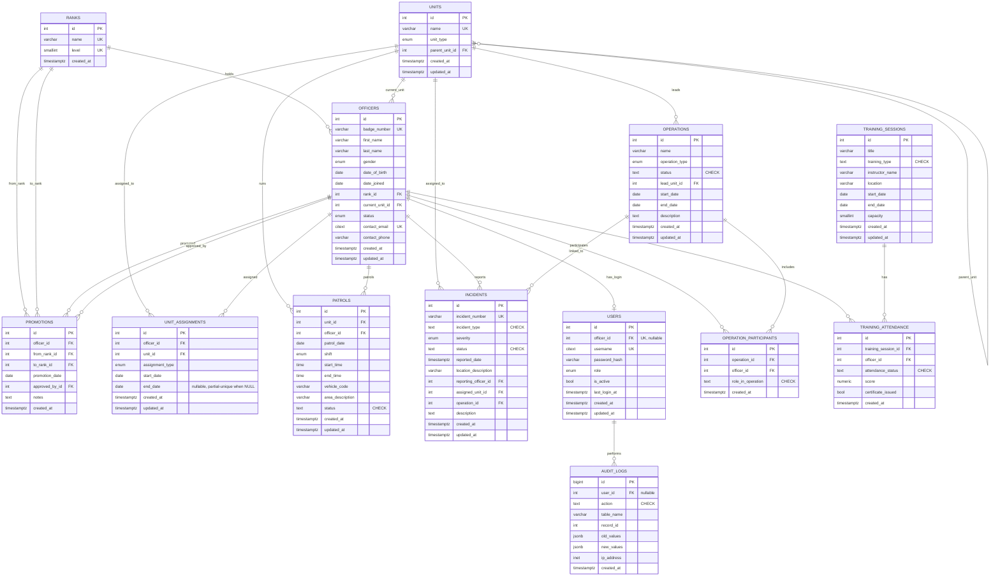

# OpsTrack — Entity-Relationship Diagram

> Generated from `database/schema.sql`. All entities are synthetic
> (fictional portfolio project).

## Notable relationship rules (enforced at the DB level, not just app-level)

- `officers.badge_number` is unique and must match `^[A-Z]{2,4}-[0-9]{4,6}$`.
- `users.officer_id` is unique (partial index, `WHERE officer_id IS NOT NULL`)
  — at most one login account per officer.
- `unit_assignments` allows only one row per officer with `end_date IS NULL`
  (partial unique index) — an officer cannot have two open assignments.
- `operation_participants` is unique on `(operation_id, officer_id)`.
- `training_attendance` is unique on `(training_session_id, officer_id)`.
- `promotions.from_rank_id <> to_rank_id` — no no-op promotions.
- Deleting a `rank` or `unit` that is still referenced by `officers` is
  **restricted** (`ON DELETE RESTRICT`); deleting a `unit` referenced by
  `officers.current_unit_id` alone (not via FK restrict) is **not** the
  case — see schema for exact per-column delete behavior (mixed
  RESTRICT/SET NULL/CASCADE by relationship semantics).
